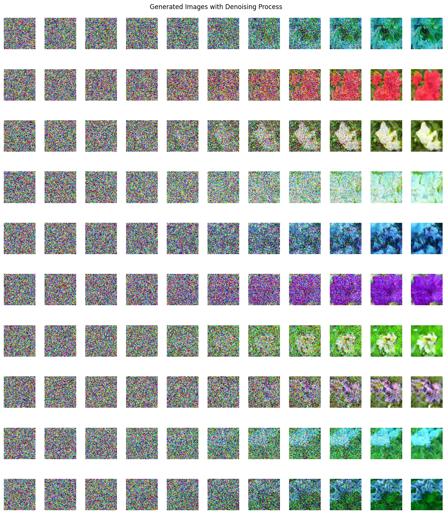

# Oxford_102_Flower_Tiny_DDPM
## Model Architecture
 
[View full diagram in Figma](https://www.figma.com/design/4ryh8Wf7BSLXqbDtOPPQ5S/Architecture?node-id=0-1&t=oSFaurOhlYnNLDIJ-1)

!! Warnings: This image must be fixed. !!

## Training

## Inference
